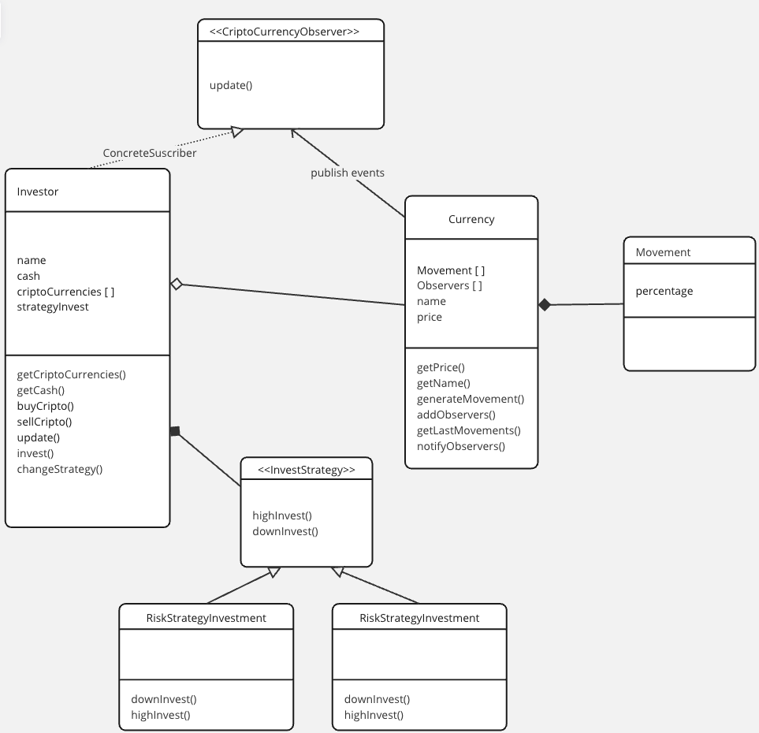

# Modelo de parcial:

Se desea desarrollar un sistema de inversión en criptomonedas, que permitirá a un inversor registrarse para realizar inversiones de forma automática en criptomonedas.

Cada inversor posee un dinero disponible para comprar criptomonedas, y una cierta cantidad de criptomonedas, que puede vender o comprar.

La criptomoneda tendrá una lista de movimientos, que pueden ser baja, o alta. Cada vez que sube, o baja, la criptomoneda, se modifica el valor de la cripto, y se guarda dicho movimiento en la lista.

Cada inversor puede seleccionar su perfil de inversor, el cual determinará la forma en que se hará una inversión (tener en cuenta que un inversor podría querer cambiar de perfil a lo largo del tiempo). Existirán dos tipos de inversores:

* Arriesgado
* Conservador

Las inversiones se harán en base a la cantidad de dinero que el inversor tenga disponible, y según los últimos 8 movimientos de la cripto. Cada tipo de inversor tendrá tres formas para invertir:
* Invertir en baja: Cuando la sumatoria de movimientos es negativa.
* Invertir en alta: Cuando la sumatoria de movimientos es positiva, o igual a 0.

Las formas de invertir según el perfil son las siguiente:
* Arriesgado:
    * Baja: invierte el 50% del dinero disponible
    * Alta: vende el 50% de sus criptomonedas
* Conservador:
    * Baja: vende el 60% de sus criptomonedas.
    * Alta: invierte el 30% de su dinero disponible.

#### Patrones identificados

Observer para el sistema de inversion en criptomonedas
Strategy para el perfil del inversor

#### Diagrama de clases

